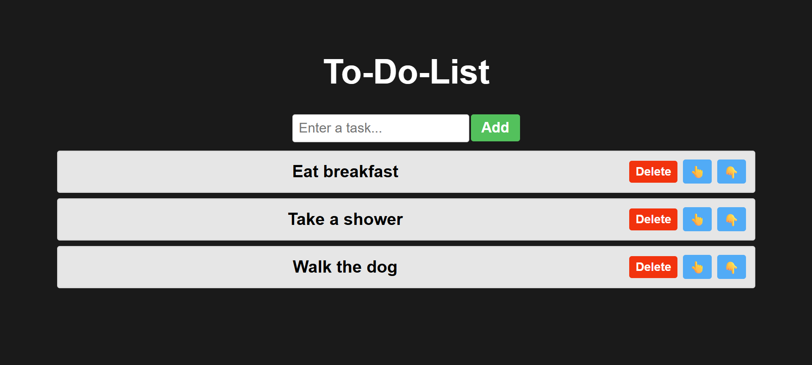

# 📝 React To-Do List App

A simple and interactive To-Do List application built using React.  
It allows users to add, delete, and reorder their daily tasks with an intuitive interface.

---

## 🚀 Features

- ✅ Add new tasks to the list  
- ❌ Delete existing tasks  
- 🔼 Move tasks up  
- 🔽 Move tasks down  
- ⚛️ Built with React functional components and hooks

---

## 📸 Preview

 

---

## 🛠️ Tech Stack

- [React](https://reactjs.org/) (with Hooks)  
- JavaScript (ES6+)  
- HTML5  
- CSS3  

---

## 📦 Installation

1. **Clone the repository**
   ```bash
   git clone https://github.com/vikas-shirsath/To-Do-List-React-App.git
   ```

2. **Navigate to the project directory**
   ```bash
   cd todo-react-app
   ```

3. **Install dependencies**
   ```bash
   npm install
   ```

4. **Start the development server**
   ```bash
   npm start
   ```

5. Open `http://localhost:3000` in your browser to view the app.

---

## 📁 Project Structure

```
todo-react-app/
├── public/
│   └── index.html
├── src/
│   ├── App.js
│   ├── ToDoList.jsx
│   ├── index.js
│   └── styles.css
├── package.json
└── README.md
```

---

## ✨ Usage

- Enter a task in the input field and click **Add**.  
- Click the **👆** or **👇** arrows to move a task up or down.  
- Click **Delete** to remove a task from the list.  

---


## 🙋‍♂️ Author

**Vikas Pandharinath Shirsath**  
B.Tech in Information Technology  
📫 vikasshirsath04@gmail.com
📫 https://www.linkedin.com/in/vikas-shirsath-464453290/
